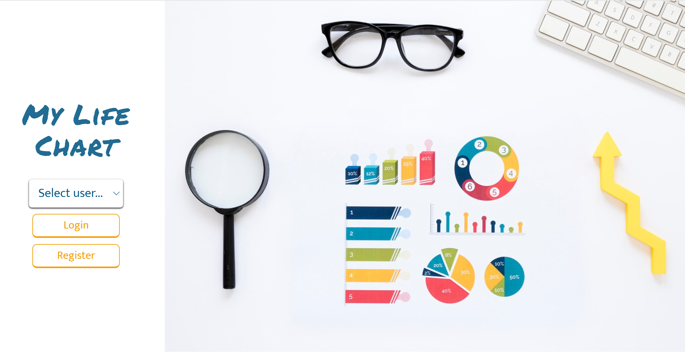

# My Life Chart

## **Table of Contents**

- [**Table of Contents**](#table-of-contents)
- [**Description**](#description)
- [**My experience**](#my-experience)
- [**Usage**](#usage)
- [**Technologies Used**](#technologies-used)
- [**Preview**](#preview)
- [**Deployed link**](#deployed-link)
- [**Future Development**](#future-development)
- [**Questions**](#questions)

## **Description**

This project was designed to create a web application where the user can see their life activities through statistical charts. 

This application consists of a React/Typescript frontend and Java/Spring backend.

## **My experience**


## **Usage**

```
npm run dev 
```

## **Technologies Used**

* React
* Typescript
* Tailwind
* ChartJs
* DayJS
* Java
* Spring
* MySQL
  
## **Preview**

* **Homepage**



* **Chart: Km ran per week in a semester**


* **Dashboard**


* **Activities list**


* **Create activity form**


## **Deployed link**

💡 Live version: [Coming soon!]()

## **Future Development**

* Auth

## **Questions**

* Contact me on my GitHub profile: [Marcela's GitHub](https://github.com/marcelamejiao)
